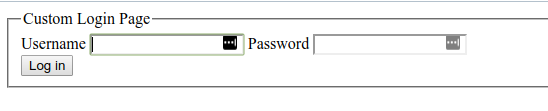

### Spring Security configurations with Custom Login Page

After starting App just go to:

    http://localhost:8081
    
You will see custom login page:

You can copy autogenerated password from console and enter following:

    user
    **** 
    
However, you will go to error page because app doesn't have any index page :-(   
You can change it and add some home page